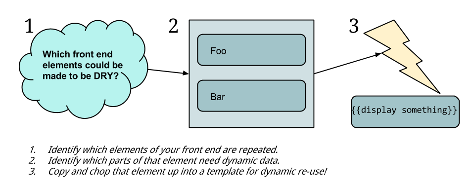

## The thought process behind this

**Fun fact:** One of the reasons that Handlebars is great is that there is a *runtime* version of the library that allows you to use pre-compiled templates. Size comparison:

- `handlebars.min.js` = 65KB
- `handlebars-runtime.min.js` = 10KB

## >> <a href='https://github.com/code-for-coffee/IntroductionToHandlebars/blob/master/1-Introduction/1_3.md'>Next</a>
